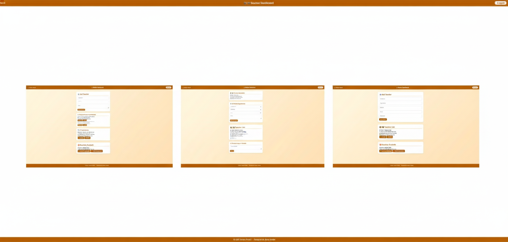

🧾 README.md

# 🎓 Student–Teacher Booking Appointment

This is a **modern appointment booking system** built with **HTML, CSS, and JavaScript**, now fully powered by **Firebase Authentication + Firebase Firestore** for real-time data, secure login, and multi-role dashboards (Admin, Teacher, Student).

The project supports dynamic appointment management, messaging between student & teacher, real-time status updates, and Firestore-based role validation.

---

## 🌐 Live Demo

👉 **[View the Website]()**  
Experience real-time appointment approval and role-based dashboard access.

---

## 📸 Preview

| Screenshot |
| ---------- |



---

## ✨ Features

### 🧑‍🏫|👩‍🏫 Teacher Dashboard

- View incoming appointment requests from students
- Approve or Reject appointments → instantly updates on both dashboards
- View Approved Appointments, Pending, and All Appointments
- Reply to student messages (one-way teacher → student reply system)
- Protected by Firestore rules (only teacher-owner can modify related appointments)

### 🎓 Student Dashboard

- Request new appointments with selected teachers
- View appointment status in real-time (pending → approved / rejected)
- Cancel their own appointment (if rules allow)
- Send messages/questions to teachers
- View teacher reply directly in dashboard
- Simple, clean UI optimized for mobile

### 👑 Admin Dashboard

- View all teachers and students
- Global access to all appointments
- Approve, delete, or manage any data
- Add new teacher accounts manually
- Admin verified via Firestore user role

### 🎨 UI & Design

- Clean white–blue theme with shadowed cards
- Responsive dashboard grid
- Sidebar navigation
- Simple and readable forms
- Real-time loading indicators (“Checking authentication…”)
- Works on all screen sizes

---

## 🗂️ Project Structure

```bash
📦 project/
│
├── index.html        # Login/Register page (Student/Teacher/Admin)
├── student.html      # Student dashboard
├── teacher.html      # Teacher dashboard
├── admin.html        # Admin dashboard
│
├── student.js        # Student logic (appointments, messaging)
├── teacher.js        # Teacher logic (approve/reject/update)
├── admin.js          # Admin authentication + data management
├── firebase.js       # Shared Firebase initialization
│
└── style.css         # Main styling for all pages
```

---

## ⚙️ Firestore Structure

| Collection     | Description                                          |
| -------------- | ---------------------------------------------------- |
| `users`        | User profiles + role (`admin`, `teacher`, `student`) |
| `appointments` | Appointment requests + status updates                |
| `messages`     | Student → Teacher messages + teacherReply            |

---

## 🧩 Default Accounts

```js
// Admin
Email: admin@example.com
Password: adminone

// Teacher
Email: teacher@example.com
Password: teacherone

// Student
Email: student@example.com
Password: studentone
```

---

## 🧠 How It Works

1. User logs in via Firebase Authentication

2. Role is loaded from Firestore: users/{uid}.role

3. User redirected to their dashboard

4. Appointments stored in appointments:

- studentEmail
- teacherEmail
- date
- time
- status (pending, approved, rejected)

5. Teacher approves/rejects → Firestore rules allow update only to status

6. Messaging stored in messages

7. Data syncs instantly via Firestore real-time snapshots

---

### 🔐 Firestore is the main database for:

- 📅 Appointments
- 💬 Messages
- 👥 Users (roles)
- ✔️ Teacher approval updates

---

## 📱 Responsiveness

- Fully responsive grids

- Works cleanly on mobile

- Sidebar collapses automatically

- Cards stack neatly on smaller screens

---

## 🚀 Getting Started

1️⃣ Clone or Download

```bash
   git clone https://github.com/yourusername/student-teacher-booking.git
```

2️⃣ Run locally:

```bash
open index.html
```

3️⃣ Insert your Firebase config in firebase.js

4️⃣ Ensure Firestore Rules are configured (provided in documentation)

---

## 💡 Developer Notes

- All role validation happens after login

- Firestore Rules enforce strict permissions

- Teacher can only update their own appointment status

- Students cannot modify others' appointments

- Admin bypass can be enabled if required

- Real-time updates improve user experience significantly

---

## 👨‍💻 Author

GitHub Profile 🔗 [RaidanRei](https://github.com/RaidanRei)

If you like this project, feel free to ⭐ star the repository!

---
